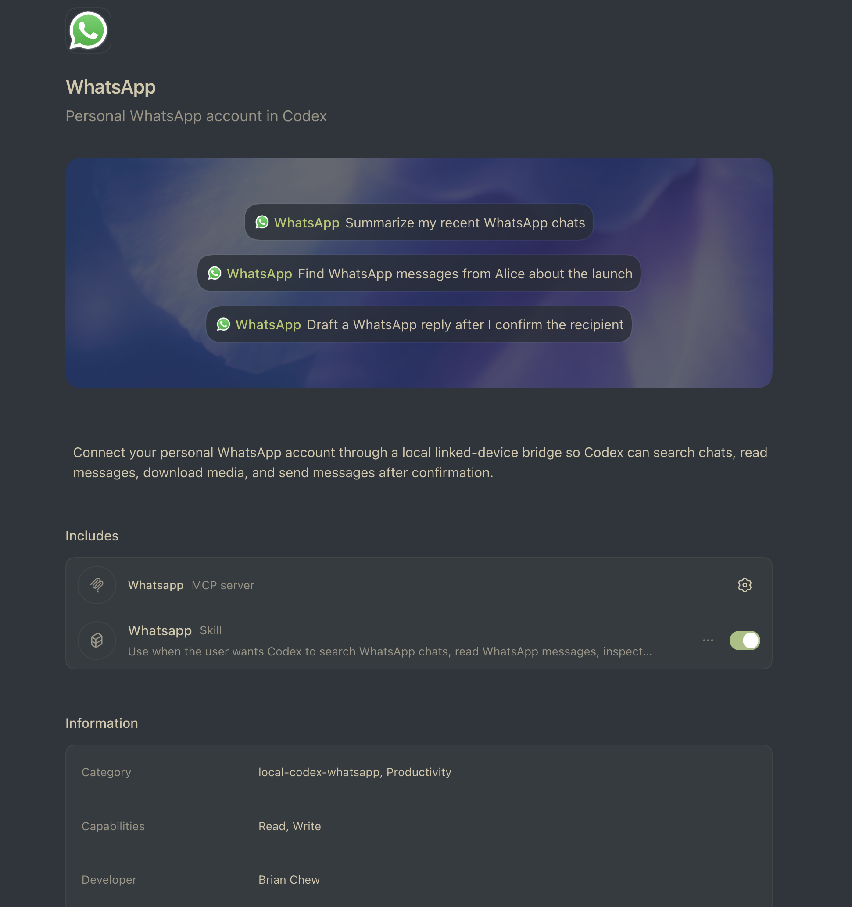

# Codex WhatsApp Plugin


> Platform note: this plugin currently targets macOS only. Windows setup and
> Windows background-service support are intentionally out of scope for now.

Unofficial third-party Codex plugin wrapper for [`lharries/whatsapp-mcp`](https://github.com/lharries/whatsapp-mcp).
It lets Codex search contacts/chats/messages, download media, and send WhatsApp
messages or files through your personal WhatsApp linked-device session.

This project is not affiliated with, endorsed by, or sponsored by WhatsApp,
Meta, or their affiliates. WhatsApp is a trademark of its respective owner, and
this project does not claim ownership of WhatsApp brand assets. The WhatsApp
logo is displayed only to identify the compatible service.

## Why MCP Instead Of A CLI?

[`wacli`](https://wacli.sh/) is a strong terminal-first option. It ships as a
single Go binary, pairs as a linked WhatsApp Web device, syncs messages into a
local SQLite/FTS5 store, and exposes search, send, media, contacts, chats,
groups, diagnostics, `--json`, `--events`, `--read-only`, and store-locking
workflows for scripts and humans. If your main workflow is shell scripting,
cron, or direct terminal use, a CLI may be the better fit.

This plugin chooses MCP because the primary user is an AI agent inside Codex:

- Codex discovers named WhatsApp tools with schemas instead of learning command
  strings, flags, shell quoting, and output parsing rules.
- Contacts, chat JIDs, messages, media paths, and send parameters move through
  structured tool arguments and results.
- Write actions have an explicit tool boundary: the send tools require
  `confirm_send=true` after the exact recipient and content are confirmed.
- The Codex plugin manifest, MCP entry, skill, health checks, setup scripts,
  and macOS background service install as one local integration.
- WhatsApp auth, indexed messages, downloaded media, and the bridge token stay
  in the local private store; data reaches the model only through tool results
  returned for the user's request.

In short: this is not MCP because CLIs are bad. It is MCP because WhatsApp in
Codex should feel like a typed local capability with explicit write gates, not
a shell subprocess the agent has to rediscover on every prompt.

## Codex Marketplace Model

A Codex marketplace is a catalog of plugins. Its `interface.displayName` is the
dropdown label in Codex, while this plugin's `interface.displayName` is the
installable item shown inside that marketplace.

For a single local selector, keep all local plugin entries in one user-level
marketplace at `~/.agents/plugins/marketplace.json`. Do not keep a repo-local
`.agents/plugins/marketplace.json` active for this checkout unless you
intentionally want Codex to show this repository as a separate marketplace.

This repo's plugin bundle is `whatsapp/`. In the shared `Local Plugins`
marketplace, the plugin should be installed as:

```bash
codex plugin add whatsapp@local
```

The matching Telegram plugin uses the same model: one `Local Plugins`
marketplace, separate `whatsapp` and `telegram` plugin entries.

For checkouts under `~/dev`, the relevant `plugins` entries look like this.
Preserve any other plugins already present in your local marketplace file.

```json
{
  "name": "local",
  "interface": {
    "displayName": "Local Plugins"
  },
  "plugins": [
    {
      "name": "whatsapp",
      "source": {
        "source": "local",
        "path": "./dev/codex-whatsapp-plugin/whatsapp"
      },
      "policy": {
        "installation": "AVAILABLE",
        "authentication": "ON_INSTALL"
      },
      "category": "Productivity"
    },
    {
      "name": "telegram",
      "source": {
        "source": "local",
        "path": "./dev/codex-telegram-plugin/telegram"
      },
      "policy": {
        "installation": "AVAILABLE",
        "authentication": "ON_INSTALL"
      },
      "category": "Productivity"
    }
  ]
}
```

## macOS Quick Start

This is the recommended path for a first-time macOS setup.

1. Install the macOS build tools and dependencies:

   ```bash
   xcode-select --install
   brew install go python uv ffmpeg
   ```

   If you do not have Homebrew yet, install it from
   [brew.sh](https://brew.sh/) first. `ffmpeg` is optional, but recommended if
   you want WhatsApp voice-message/audio conversion to work smoothly.

2. From this repository root, check that the plugin can build and run:

   ```bash
   bash whatsapp/scripts/check-health.sh
   ```

3. Start the WhatsApp bridge in a visible terminal for the first pairing:

   ```bash
   bash whatsapp/scripts/start-bridge.sh
   ```

   On first run, scan the QR code from WhatsApp on your phone:
   `Settings > Linked Devices > Link a Device`. Leave this terminal open while
   you finish setup.

4. Install the local plugin into Codex from the shared local marketplace:

   ```bash
   codex plugin add whatsapp@local
   ```

   If the local marketplace does not include this checkout yet, add a
   `whatsapp` entry that points at this repo's `whatsapp/` directory, then rerun
   the command above. Keep the marketplace name as `local` and the display name
   as `Local Plugins` if you want it grouped with your other local plugins.

   Restart Codex and start a fresh thread after installing. Old threads can miss
   newly installed plugin, skill, and MCP context.

5. After the first QR pairing works, install the macOS background service so the
   bridge can keep running without a terminal window:

   ```bash
   bash whatsapp/scripts/bridge-service.sh install
   bash whatsapp/scripts/bridge-service.sh status
   ```

   For plugin upgrades, prefer running helper scripts from the installed plugin
   copy under `~/.codex/plugins/cache/...`; see [Install In Codex](#install-in-codex).

If setup fails, run `bash whatsapp/scripts/check-health.sh` again first. The
most common fixes are installing missing build tools, freeing port `8080`, or
starting `start-bridge.sh` in a visible terminal when a new QR code is needed.

### Agent Setup Prompt

Paste this into Codex from the repository root if you want an agent to run the
macOS setup for you:

```text
Set up this Codex WhatsApp plugin on this Mac. Please install or verify the
needed macOS dependencies, run the health check, start the WhatsApp bridge for
first-time QR pairing if needed, install the local plugin into Codex, then set
up the macOS background service after pairing works. Do not send any WhatsApp
messages. Stop and ask me to scan the QR code if WhatsApp needs pairing, then
verify the bridge/service status and summarize what changed.
```

## What It Bundles

The actual Codex plugin bundle is `whatsapp/`, mirroring the layout used by
`codex-telegram-plugin`. Local marketplace registration lives outside this repo
in `~/.agents/plugins/marketplace.json`.

- `whatsapp/.codex-plugin/plugin.json`: Codex plugin manifest.
- `whatsapp/.mcp.json`: Codex MCP server entry for WhatsApp.
- `whatsapp/assets/icon.svg`: WhatsApp logo used in the composer and plugin UI.
- `whatsapp/skills/whatsapp/SKILL.md`: workflow guidance for Codex.
- `whatsapp/scripts/`: setup, health, bridge, and reset helpers.
- `whatsapp/vendor/whatsapp-mcp/`: vendored upstream WhatsApp bridge and MCP server.

The upstream integration is two processes:

1. `whatsapp-bridge`: Go process that links to WhatsApp, syncs messages into SQLite, and exposes `http://127.0.0.1:8080/api`.
2. `whatsapp-mcp-server`: Python stdio MCP server that Codex starts from `.mcp.json`.

Python dependencies are installed by `uv` into
`${XDG_CACHE_HOME:-$HOME/.cache}/codex-whatsapp-plugin/` so the plugin tree
stays clean.

## Prerequisites

The macOS quick-start command above installs the normal dependency set. In
detail, the plugin needs:

- Go 1.25+ or a Go toolchain with automatic toolchain downloads enabled
- Python 3.11+
- `uv`
- WhatsApp mobile app/account for QR pairing
- C compiler/CGO support for `go-sqlite3`
- Optional: `ffmpeg` for converting non-Opus audio into WhatsApp voice messages

If you are not using Homebrew, install `uv` directly:

```bash
curl -LsSf https://astral.sh/uv/install.sh | sh
```

## Local Development

Check setup:

```bash
bash whatsapp/scripts/check-health.sh
```

Start the WhatsApp bridge:

```bash
bash whatsapp/scripts/start-bridge.sh
```

On first run, scan the QR code from WhatsApp:
`Settings > Linked Devices > Link a Device`.

Keep the bridge terminal open while Codex uses the MCP tools, or install the
macOS background service below.

### Run The Bridge In The Background

After the first QR pairing succeeds, you can run the bridge as a macOS
LaunchAgent so you do not need to keep a terminal window open:

```bash
bash whatsapp/scripts/bridge-service.sh install
```

Useful service commands:

```bash
bash whatsapp/scripts/bridge-service.sh status
bash whatsapp/scripts/bridge-service.sh logs
bash whatsapp/scripts/bridge-service.sh restart
bash whatsapp/scripts/bridge-service.sh uninstall
```

The MCP startup script also tries to auto-start the bridge in the background
when Codex starts the WhatsApp MCP server. Set `WHATSAPP_BRIDGE_AUTO_START=0`
to disable that behavior.

Logs are written under:

```text
${XDG_STATE_HOME:-$HOME/.local/state}/codex-whatsapp-plugin/
```

If your linked-device session expires and a new QR code is needed, use
`start-bridge.sh` in a visible terminal or inspect `bridge-service.sh logs`.

## Install In Codex

After the shared local marketplace includes this checkout:

```bash
codex plugin add whatsapp@local
```

If `whatsapp@local` is not found, add this checkout's `whatsapp/` directory to
`~/.agents/plugins/marketplace.json` under the existing `local` marketplace,
then rerun the install command. Do not keep a repo-local
`.agents/plugins/marketplace.json` active unless you intentionally want a
separate marketplace entry in the Codex dropdown.

Codex installs local plugins into `~/.codex/plugins/cache/...` and loads the
installed copy from there. After installing, prefer running helper scripts from
the installed copy so the bridge version matches the MCP server version:

```bash
PLUGIN_ROOT="$(python3 - <<'PY'
from pathlib import Path
roots = sorted(
    Path.home().glob(".codex/plugins/cache/*/whatsapp/*"),
    key=lambda p: p.stat().st_mtime,
    reverse=True,
)
print(roots[0] if roots else "")
PY
)"

bash "$PLUGIN_ROOT/scripts/check-health.sh"
bash "$PLUGIN_ROOT/scripts/start-bridge.sh"
```

Or install the background service from the installed plugin copy:

```bash
bash "$PLUGIN_ROOT/scripts/bridge-service.sh" install
```

If `PLUGIN_ROOT` is empty, install the plugin from the local marketplace first.
Runtime state still lives in the shared external store documented below, so
upgrades do not wipe your linked-device session.

## Tools

The bundled upstream MCP server exposes:

- `search_contacts`
- `list_messages`
- `list_chats`
- `list_events`
- `backfill_events`
- `list_desktop_events`
- `get_chat`
- `get_direct_chat_by_contact`
- `get_contact_chats`
- `get_last_interaction`
- `get_message_context`
- `send_message`
- `send_file`
- `send_audio_message`
- `create_group`
- `add_group_participants`
- `add_or_invite_group_participants`
- `get_group_invite_link`
- `download_media`

Use read-only tools first to confirm contacts, chat JIDs, and message context.
`list_events` returns event cards captured by the bridge. If older event cards
are missing, use `backfill_events` to request on-demand history sync for the
chat, then run `list_events` again. On macOS, if an event appears in WhatsApp
Desktop's group info event drawer but is still missing from the bridge index,
open that drawer and use `list_desktop_events` to read the visible Desktop
event rows via accessibility.
For sends, confirm the final recipient and content before calling send tools.
For group participant changes, prefer invite links for raw phone numbers. Direct
adds by raw phone number may be rejected by WhatsApp with participant-level 403
errors, and that path has been observed to log out linked devices.
The send tools also require `confirm_send=true` as an explicit final step.
For group creation, confirm the exact group name and participant list; the tool
requires `confirm_create=true`. For group participant adds, confirm the exact
group JID and participant list; the tool requires `confirm_add=true`. For
fallback invite DMs after failed adds, also confirm the fallback message and set
`confirm_invite_message=true`.

## Reset Auth Or Message State

If WhatsApp gets out of sync or linked-device auth expires:

```bash
bash whatsapp/scripts/reset-session.sh
```

The script requires typing `RESET` and removes only local WhatsApp SQLite
session/index files. You will need to scan the QR code again.

## Private Data

Runtime data lives outside the plugin install directory so it survives plugin
upgrades:

```text
${XDG_DATA_HOME:-$HOME/.local/share}/codex-whatsapp-plugin/store/
```

That directory contains WhatsApp auth state, indexed messages, and downloaded
media, plus a local bridge token used to authenticate MCP-to-bridge HTTP
requests. The bridge creates it with `0700` permissions; do not commit or share
its contents.

If you previously paired against the legacy in-tree location
(`whatsapp/vendor/whatsapp-mcp/whatsapp-bridge/store/`), move its contents into
the new path once before restarting the bridge:

```bash
NEW_STORE="${XDG_DATA_HOME:-$HOME/.local/share}/codex-whatsapp-plugin/store"
mkdir -p "$NEW_STORE"
mv whatsapp/vendor/whatsapp-mcp/whatsapp-bridge/store/* "$NEW_STORE/" 2>/dev/null || true
```

The vendored bridge is patched to bind only to `127.0.0.1`, redact message
contents from terminal logs by default, sanitize downloaded media filenames,
and store downloaded media with owner-only file permissions. Set
`WHATSAPP_MCP_DEBUG_CONTENT=1` only when you explicitly need content-level
bridge logs.

### Optional Environment Overrides

Both the bridge and the MCP server respect:

- `WHATSAPP_MCP_STORE_DIR`: absolute path for SQLite stores and downloaded
  media. Defaults to `${XDG_DATA_HOME:-$HOME/.local/share}/codex-whatsapp-plugin/store`.
- `WHATSAPP_BRIDGE_PORT`: TCP port for the local bridge REST API. Defaults to
  `8080`. Override if `8080` is already in use on your machine.
- `WHATSAPP_MCP_DEBUG_CONTENT=1`: re-enable content-level bridge logs (off by
  default).
- `WHATSAPP_BRIDGE_TOKEN`: shared token for local MCP-to-bridge HTTP requests.
  The helper scripts create and store one automatically under the private store
  directory.

## License

This repository's wrapper code is MIT licensed. The vendored upstream project
is MIT licensed by Luke Harries; see `NOTICE.md` and
`whatsapp/vendor/whatsapp-mcp/LICENSE`.

Runtime dependencies keep their own licenses. This source release includes Go
and Python dependency manifests; if you distribute built bridge binaries, review
and comply with dependency licenses, including `go.mau.fi/whatsmeow` and
`go.mau.fi/libsignal`.
